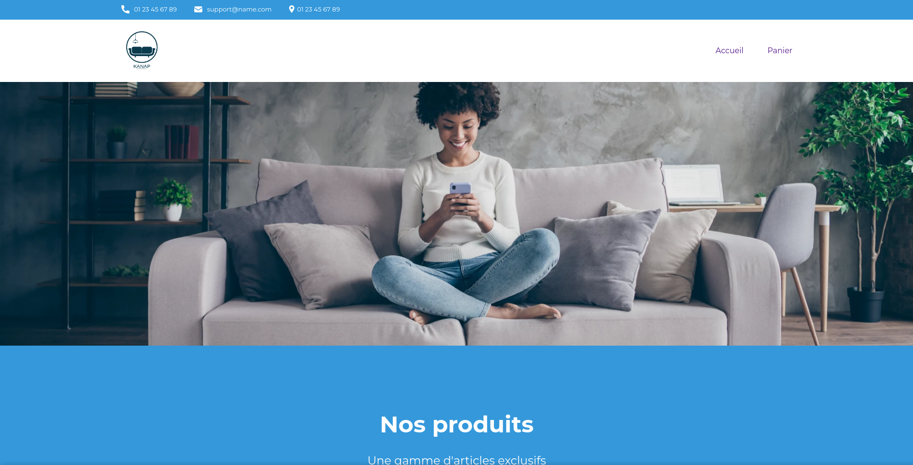

<h1 align="center">
    <br>
    <a href="https://stevancorre.github.io/la-panthere">
        
    </a>
    <br>
    Kanap Website
    <br>
</h1>

<h4 align="center">An <a href="https://openclassrooms.com/en/">OpenClassrooms</a> assignment about using an API in the front end.</h4>

<p align="center">
    <a href="https://nodejs.dev">
        
    </a>
    <a href="https://www.w3.org/html/">
        
    </a>
    <a href="https://www.w3.org/Style/CSS/">
        
    </a>
    <a href="https://www.javascript.com/">
        
    </a>
    <a href="https://paypal.me/aiixu">
        
    </a>
</p>

<p align="center">
    <a href="#preview">Preview</a> •
    <a href="#quick-start">Quick start</a> •
    <a href="#license">License</a> •
    <a href="#credits">Credits</a> 
</p>

## Preview



<br>

## Quick start

You'll first need to host the API locally (see: [api#quick-start](https://github.com/kanap-shop/api#quick-start))

```sh
# clone repo
$ git clone https://github.com/kanap-shop/api.git

# install dependencies
$ yarn install

# serve on localhost
$ yarn serve

# build
$ yarn build
```

<br>

## License

This project is <a href="https://opensource.org/licenses/MIT">MIT</a> licensed.

<br>

## Credits

- README design: <a href="https://github.com/amitmerchant1990/electron-markdownify/blob/master/README.md">github.com/amitmerchant1990</a>